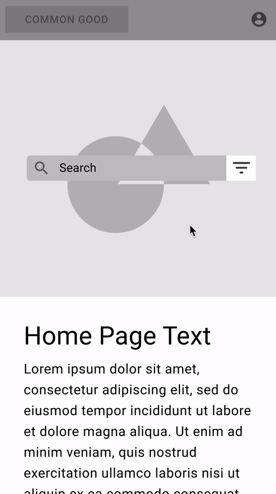

# Common Good Website Repo

... In progress

## About 

This project aims to allow users to more adequately search businesses.  Currently the hope is to allow users to filter by minority owned busineses and female owned businesses, as well as sustainably owned busineses.  Most of the data will be provided by users themselves.

## Features 

### Search
Anyone will be able to search and filter using location, female owned businesses, minority owned business, and sustainably owned businesses.

### User Added Businesses
As mentioned before the goal is to have users provide the data for businesses.  They will be able to do this through a wizard.

### User Reviews
Users can write reviews about businesses which they like providing a rating out of 5 stars and leaving a comment, they will later be able to view their reviews.

### User Suggested Edits
Users will be able to Suggest Edits to businesses to always keep the business information up to date.

### User Favorites
Users will be able to Favorite businesses, assigning these favoites to Favorite Groups.  Users will then be able to make these favorite groups public, allowing anyone to view their curated list of businesses, say a list of Female owned Wedding Planner Businesses.

## Mocks
[Figma Mocks](https://www.figma.com/file/OBixuzmcR47mjDk2oid4eE/Common-Good-UI?node-id=33133%3A29379)
